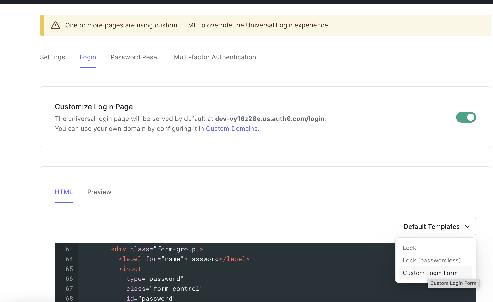

# auth0-exploration

This repository is to explore the possibilities with Auth0 + React.

The main goal is to understand how we can have:

- A full custom Login page
- Support username and password users
- Support Google account users
- Only invited users can participate

## Approach #1 - Using @auth0/auth0-react

In this option, we are following this [tutorial](https://auth0.com/docs/quickstart/spa/react/01-login).

### Discoveries

#### Very easy to setup

In 5 minutes you have a login with a great security and social media integrations.

#### We need to redirect the user with loginWithRedirect()

This is easy to overcome, we can redirect to this page automatically when access Zion.

#### Not that easy to customize the pages

We are reading and learning from this [page](https://auth0.com/docs/customize/universal-login-pages/customization-classic).

##### Simple customizations

To apply simple customizations, we can go with [Lock template](https://auth0.com/docs/libraries/lock).

##### Significant customizations on UI

In this case, we have to go with Auth0.js SDK and Custom Login Form. By reading this [response](https://community.auth0.com/t/how-do-i-implement-a-custom-ui-login-instead-of-using-lock/19693/3) in Auth0 forum, we understand that:

- We can update with Auth0.js SDK
- We can create our UI and hit their APIs endpoints correctly
- [Customize New Universal Login Pages](https://auth0.com/docs/customize/universal-login-pages/universal-login-page-templates)

###### API endpoints

This is kind of hard, in one hour we could not deal with 302 redirect. Maybe because NGROK is blocking the access for the first visit with their warning page.

It supports Credentials and Google login

###### Auth0 SDK

It's possible to use them, but it's kind of hard to restructure the frontend in case that you are using `auth0-react` previously.

It supports Credentials and Google login

###### Custom Login Form

With that, we just need to go to the Branding > Universal Login > Login and change the Default Templates select box to `Custom Login Form`.

There you will have a HTML + CSS + Vanilla Javascript + Auth0 SDK.

It's the fastest way to provide a Custom Layout in a system that already works with `auth0-react`.

## To test

To test you can go with the following files on `index.tsx`:

- `AppWithRedirect.tsx`: To test with @auth0/auth0-react
- `AppWithAPI.tsx`: To test with their endpoints
- `AppWithSDK.tsx`: To test using their SDK

## Conclusion

All of 3 ways provide a good interface to create custom login pages. It's totally possible to have a totally changed UI, but the easiest one to achieve in a project using `auth0-react` is the Custom Login Form. We can edit HTML + CSS + Vanilla JS + Auth SDK. Also, in the React app we can use the `Auth0Provider` and its hooks to get client's information.

